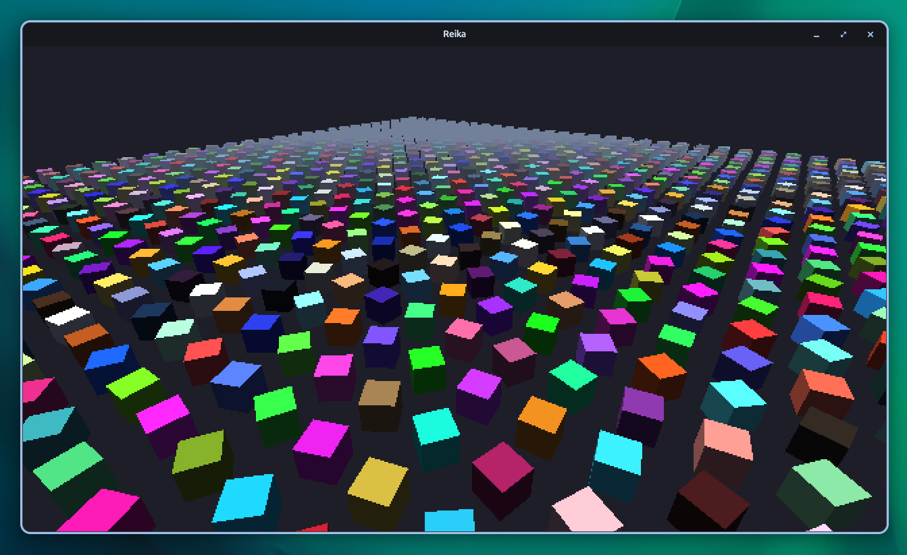

# Reika Engine

Reika is a high-performance, open-source  3D game engine which embraces the nostalgic and beautiful style and aesthetic of the Playstation 1. It is developed using the Odin programming language along with the Raylib graphics library.



## ⚠️ Disclaimer

This game engine is extremely premature. I personally have only tested it on my system (a Ubuntu-based distro), so OS specific issues may arise on your end.

Furthermore, you need the **Odin programming language** installed on your system and linked to your PATH. Otherwise, the project will simply not build. [Here is the official Odin installing guide](https://odin-lang.org/docs/install/).

## Premature Checklist

The following is the list of layers to be implemented in-order:

- [x] Core package/loop + window
- [x] Memory Management
- [x] Math Package (RMath)
- [x] ECS (Entity Component System)
- [x] Basic Renderer
- [x] Camera System
- [x] Profiler (bound to F1)
- [x] Material Service <- we're here
- [ ] Mesh Service
- [ ] Texture Service
- [ ] Asset Pipeline
- [ ] PS1 Style Renderer
- [ ] Lighting/art Pipeline
- [ ] Scene/world Management
- [ ] Lua Scripting
- [ ] Polish Systems (Animation, Physics...)
- [ ] Tooling

## Dependencies

In order to try out and build the game engine on your system, you will need to have the most recent version of the **Odin programming language** installed in your system and linked to your PATH. You however do **not** need to install Raylib—**Odin** already comes pre-bundled with Raylib 5.5 under the `vendor:` package.
> It is possible that later, a custom installation of Raylib 6 comes with this project for better features than the current set.

If you haven't already installed Odin, [here is the official Odin installing guide](https://odin-lang.org/docs/install/).

## Build Instructions

Because of the way Odin works, the build instructions for Linux, Windows and MacOS are all extremely similar.

Once you've cloned the repository, execute the following commands from root to build:

### Linux & MacOS

```sh
# Debug build
odin build . -debug

# Release build
odin build . -o:speed

# Run executable
./Reika
```

### Windows (Powershell)

```sh
# Debug build
odin build . -debug

# Release build
odin build . -o:speed

# Run executable
.\Reika.exe
```

## Project Structure

The project is structured as follows:
* `engine/` encapsulates all directories and files related to the engine itself.
* `game/` encapsulates all directories and files related to the gameplay, runtime handlers, etc.
* `engine/core/` is the engine's core, with the main loop, engine code, time, logging, and memory management.
* `engine/ecs/` is where the engine's ECS (Entity Component System) files live.
* `engine/rmath/` is the engine's rmath package (Reika Math) will utilities and procedures like conversions.
* `engine/input/` is the engine's input package (for keyboard inputs).
* `engine/render/` is the engine's renderer, which handles the PS1 visuals and performance critical code.
* `engine/camera/` is the engine's camera system and controller
* `engine/profiler/` is the engine's profiler overlay package
